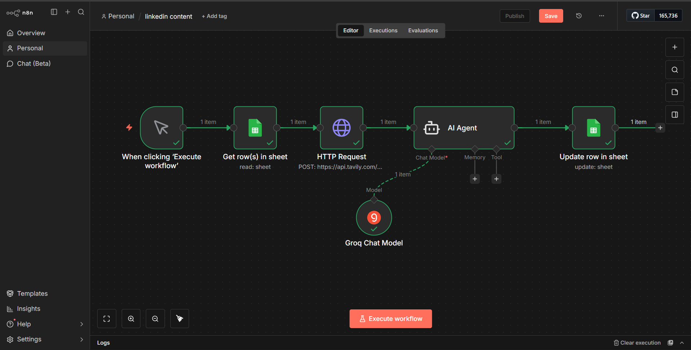
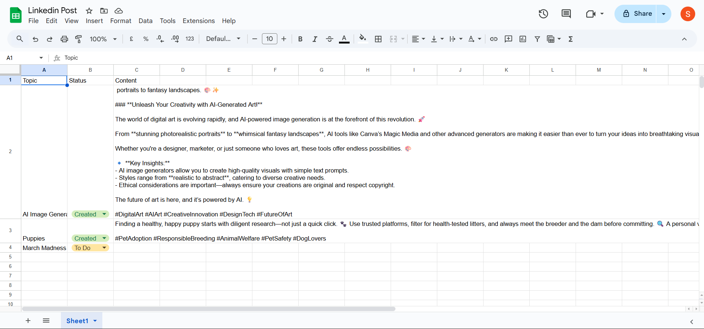

# ai-linkedin-content-agent

# AI-Powered LinkedIn Content Generator (n8n)

An AI-driven automation built using **n8n** that generates high-quality LinkedIn posts from structured Google Sheets data. The workflow enriches content using external APIs and leverages an AI Agent to create professional, engaging posts automatically.

---

## Problem Statement

Creating consistent, high-quality LinkedIn content is time-consuming and often repetitive. Professionals and teams struggle with:
- Turning raw ideas or topics into polished LinkedIn posts
- Maintaining consistency in tone and structure
- Spending excessive time on research and writing
- Managing content manually across spreadsheets

---

## Solution

This project solves the problem by building an **end-to-end AI automation** that:
- Reads content ideas directly from Google Sheets
- Enriches context using external APIs
- Uses an AI Agent to generate professional LinkedIn posts
- Automatically writes the generated content back to Google Sheets

The result is a scalable, repeatable, and hands-free content creation pipeline.

---

## Workflow Overview

1. **Manual Trigger**  
   Starts the workflow when the user clicks *Execute Workflow* in n8n.

2. **Google Sheets – Read Rows**  
   Fetches topics and metadata from a Google Sheet.

3. **HTTP Request (External API)**  
   Enriches topic context using third-party APIs (e.g., Tavily).

4. **AI Agent (LLM-powered)**  
   - Synthesizes information
   - Generates concise, professional LinkedIn post content
   - Applies a structured and engaging tone

5. **Google Sheets – Update Row**  
   Writes the generated LinkedIn content back to the sheet and updates status.

---

## AI Capabilities

- LLM-powered content generation
- Context-aware post writing
- Professional tone optimized for LinkedIn
- Structured output with emojis and hashtags
- Automated workflow orchestration

---

## Tech Stack

- **n8n** – Workflow automation
- **LLMs (Groq / OpenRouter)** – AI content generation
- **Google Sheets API** – Content source & storage
- **HTTP APIs** – Context enrichment
- **OAuth 2.0** – Secure authentication

---

## Google Sheets Structure

| Column | Description |
|------|------------|
| Topic | Post topic or idea |
| Status | To Do / Created |
| Content | AI-generated LinkedIn post |

---

## How to Use

1. Import the workflow JSON into n8n  
2. Configure:
   - Google Sheets credentials
   - LLM provider (Groq / OpenRouter)
   - HTTP API keys
3. Add topics to Google Sheets
4. Click **Execute Workflow**
5. View generated LinkedIn content in the sheet

---
## Workflow Overview

---

## Google Sheets Input / Output

---

## 🎥 Demo

📺 Loom Walkthrough:  
https://www.loom.com/share/807c46e4685a4109bbc21ed62c47d151

---

## Use Cases

- Personal branding on LinkedIn
- Content automation for founders & creators
- Social media workflow automation
- AI-powered writing assistants

